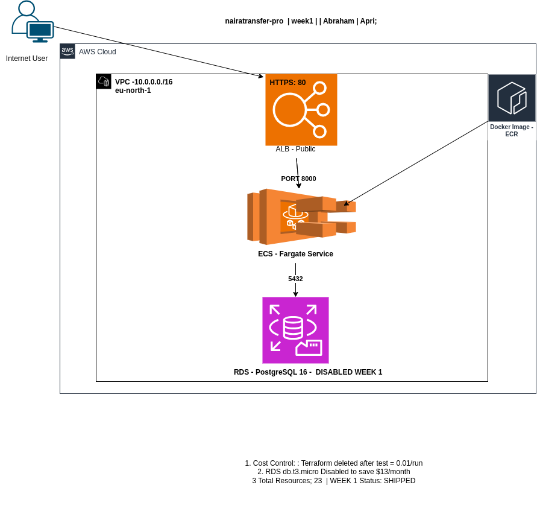

NairaTransfer Pro
A production-style fintech wallet & transfer API built with modern DevOps tools on AWS.

## Week 1 - Live Deployment ✅

**Status:** Successfully deployed on AWS ECS Fargate

**Health Check URL:**  
[http://nairatransfer-pro-alb-1554992979.eu-north-1.elb.amazonaws.com/health](http://nairatransfer-pro-alb-1554992979.eu-north-1.elb.amazonaws.com/health)

**Health Check URL:** [http://nairatransfer-pro-alb-1554992979.eu-north-1.elb.amazonaws.com/health](http://nairatransfer-pro-alb-1554992979.eu-north-1.elb.amazonaws.com/health)

**Response:**```json{"status":"ok","service":"nairatransfer-pro","

## Architecture



\*Design Decisions:\*\*

- **eu-north-1**: Cheapest Fargate region, latency to Lagos ~120ms acceptable for MVP
- **Public Subnets Only**: No NAT Gateway to stay within $100 AWS Free Tier budget
- **RDS Disabled**: `db.t3.micro` costs $13/mo. Enabled Week 3 after CI/CD is stable
- **Cost per Test**: ~$0.01 using `terraform apply` → test → `terraform destroy` strateggy

**Week 1 Resources**: 23 | **Status**: Deployed & Destroyed Successfully
